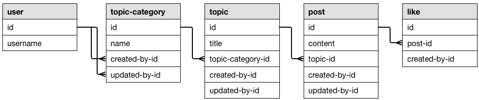
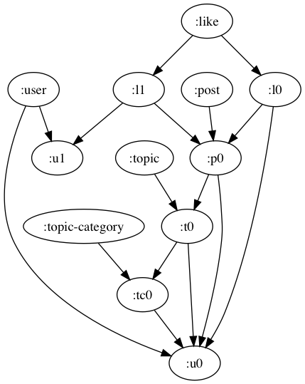
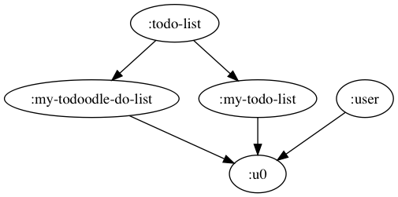
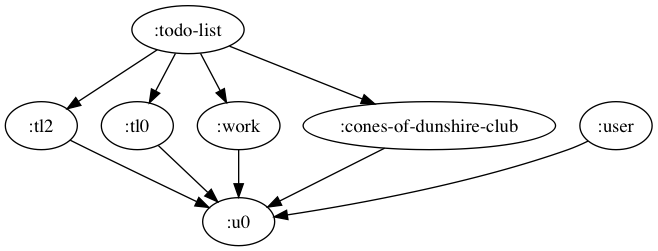
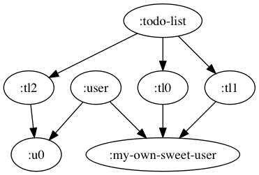
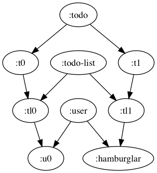
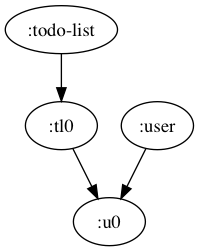
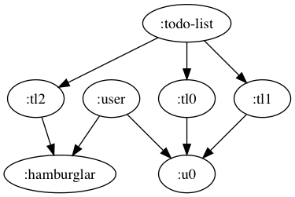

# Specmonstah

* [Introduction](#introduction)
* [Infomercial](#infomercial)
* [Tutorial](#tutorial)
* [Usage Reference](#usage-reference)
* [Glossary](#glossary)

## Deps

```clojure
[reifyhealth/specmonstah "2.0.0-alpha-1"]
```

## Introduction

Specmonstah (Boston for "Specmonster") lets you generate and
manipulate deeply-nested, hierarchical graphs of business data (what
you typically store in a relational database) using a concise
DSL. It's great for dramatically reducing the amount of boilerplate
code you have to write for tests. It's similar in purpose to Ruby's
[factory_bot](https://github.com/thoughtbot/factory_bot).


For example, say you need to test a function that inserts a _Todo_ in
a database: your foreign key constraints would require you to first
insert the _TodoList_ that the Todo belongs to, and the _User_ that
the TodoList and Todo belong to. Instead of having to write something
like this:

```clojure
(let [user      (create-user! {:username "bob" :email "bob@bob-town.com"})
      todo-list (create-todo-list! {:title         "Bob convention todos"
                                    :created-by-id (:id user)})]
  (create-todo! {:description "Book flight"
                 :todo-list-id (:id todo-list)
                 :created-by-id (:id user)}))
```

Specmonstah lets you write something like this:

```clojure
(create! {:todo [[1 {:spec-gen {:description "Book flight"}}]]})
```

Specmonstah (SM) creates the User and TodoList, and ensures that the
TodoList correctly references the User and the Todo correctly
references the TodoList and user. Call me crazy, but I think the
second snippet is preferable to the first.

SM is a specialized tool that introduces new concepts and
vocabulary. It will take an hour or two to get comfortable with it,
but once you do, that investment will pay huge dividends over time as
you use it to write code that is more clear, concise, and easy to
maintain. This guide has four parts to get you there:

* The [Infomercial](#infomercial) is a quick tour of the cool stuff you can
  do with Specmonstah, showing you why it's worth the investment
* A detailed [Tutorial](#tutorial) walks you through the library. It's
  written so the first sections get you productive with the core
  concepts quickly, and later sections fill in more esoteric details.
* The [Usage Reference](#usage-reference) contains at-a-glance code
  snippets demonstrating the facets of Specmonstah usage
* Because Specmonstah introduces new terms, we provide a
  [Glossary](#glossary)

## Infomercial

In the time-honored tradition of infomercials everywhere, these
snippets gloss over a lot of details to reveal the truest, purest
essence of a product. If you want to go all FDA on me and validate the
claims, check out [the full
source](./examples/reifyhealth/infomercial.cljc).

The code below will ~~shout at~~ show you how you can generate and
insert data for a forum's database. Here's an entity relationship
diagram for the database:



One thing the diagram doesn't capture is that, for the `like` type,
there's a uniqueness constraint on `post-id` and
`created-by-id`. Also, every instance of `created-by-id` and
`updated-by-id` refers to a user, but including that in the diagram
would just clutter it.

### Insert entity hierarchy in dependency order, with correct foreign keys

Posts have a foreign key referencing a Topic, Topics reference a Topic
Category, and all of these reference a User. The snippet below shows
that you can specify that you want one Post created, and Specmonstah
will ensure that the other entities are created and inserted in
dependency order:

```clojure
(insert {:post [[1]]})
@ent-db
; =>
[[:user {:id 1 :username "K7X5r6UVs9Mm2Eks"}]
 [:topic-category {:id 2 :created-by-id 1 :updated-by-id 1}]
 [:topic {:id 5
          :topic-category-id 2
          :title "ejJ2B88UZo2NK2sMuU4"
          :created-by-id 1
          :updated-by-id 1}]
 [:post {:id 9 :topic-id 5 :created-by-id 1 :updated-by-id 1}]]
```

The `insert` function simulates inserting records in a db by conjing
entities on the `ent-db` atom. The maps were generated using
`clojure.spec`. Notice that all the foreign keys line up.

### Specify different users

In the previous example, all entities referenced the same User. In
this one, the Topic's `created-by-id` will reference a new user:

```clojure
(insert {:topic [[:t0 {:refs {:created-by-id :custom-user}}]]
         :post [[1]]})
@ent-db
; =>
[[:user {:id 1 :username "gMKGTwBnOvB0xt"}]
 [:topic-category {:id 2 :created-by-id 1 :updated-by-id 1}]
 [:user {:id 5 :username "2jK0TXCU2UcBM89"}]
 [:topic {:id 6
          :topic-category-id 2
          :title "cmo2Vg8DQByz302c"
          :created-by-id 5
          :updated-by-id 1}]
 [:post {:id 10 :topic-id 6 :created-by-id 1 :updated-by-id 1}]]
```

Two users, one with `:id 1` and another with `:id 5`. The topic's
`:created-by-id` attribute is 5, and all other User references are
`1`.

### Multiple entities

What if you want to insert 2 or 3 or more posts?

```clojure
(insert {:post [[3]]})
@ent-db
; =>
[[:user {:id 1 :username "yB96fd"}]
 [:topic-category {:id 2 :created-by-id 1 :updated-by-id 1}]
 [:topic {:id 5
          :topic-category-id 2
          :title "KEh29Ru7aVVg2"
          :created-by-id 1
          :updated-by-id 1}]
 [:post {:id 9 :topic-id 5 :created-by-id 1 :updated-by-id 1}]
 [:post {:id 13 :topic-id 5 :created-by-id 1 :updated-by-id 1}]
 [:post {:id 17 :topic-id 5 :created-by-id 1 :updated-by-id 1}]]
```

Just say "I want 3 posts" and Specmonstah delivers.

### Uniqueness constraints

You can't have two Likes that reference the same Post and User; in
other words, a User can't Like the same Post twice. Specmonstah will
automatically generate unique Users if you specify multiple Likes:

```clojure
(insert {:like [[3]]})
@ent-db
; =>
[[:user {:id 1 :username "T2TD3pAB79X5"}]
 [:user {:id 2 :username "ziJ9GnvNMOHcaUz"}]
 [:topic-category {:id 3 :created-by-id 2 :updated-by-id 2}]
 [:topic {:id 6
          :topic-category-id 3
          :title "4juV71q9Ih9eE1"
          :created-by-id 2
          :updated-by-id 2}]
 [:post {:id 10 :topic-id 6 :created-by-id 2 :updated-by-id 2}]
 [:like {:id 14 :post-id 10 :created-by-id 1}]
 [:like {:id 17 :post-id 10 :created-by-id 2}]
 [:user {:id 20 :username "b73Ts5BoO"}]
 [:like {:id 21 :post-id 10 :created-by-id 20}]]
```

Three Likes, Three different Users, and we're not violating the
uniqueness constraint. With just one line of code. I think this
feature's particularly cool.

### Polymorphic relations

Whereas foreign keys in RDBMSs must reference records in a specific
table, some databases like Datomic have reference types attributes
that can reference any entity at all. You might want to use this in
your forum so that users can like either Topics or Posts. Specmonstah
handles this use case.

There are two snippets below. In the first, you say you want to create
three `:polymorphic-like`s with `{:ref-types {:liked-id
:post}}`. Specmonstah generates 3 likes that refer to a post. The
second snippet includes `{:ref-types {:liked-id :topic}}`, so the
likes refer to a topic. Polymorphic references compose with uniqueness
contraints, so three users are created, just like in the previous snippet.

```clojure
(insert {:polymorphic-like [[3 {:ref-types {:liked-id :post}}]]})
@ent-db
[[:user {:id 1 :username "gI3q3Y6HR1uwc"}]
 [:user {:id 2 :username "klKs7"}]
 [:topic-category {:id 3 :created-by-id 2 :updated-by-id 2}]
 [:topic {:id 6
          :topic-category-id 3
          :title "RF6g"
          :created-by-id 2
          :updated-by-id 2}]
 [:post {:id 10 :topic-id 6 :created-by-id 2 :updated-by-id 2}]
 [:polymorphic-like {:id 14 :liked-id 10 :created-by-id 1}]
 [:polymorphic-like {:id 17 :liked-id 10 :created-by-id 2}]
 [:user {:id 20 :username "Gcf"}]
 [:polymorphic-like {:id 21 :liked-id 10 :created-by-id 20}]]


(insert {:polymorphic-like [[3 {:ref-types {:liked-id :topic}}]]})
@ent-db
[[:user {:id 1 :username "5Z382YCNrJB"}]
 [:topic-category {:id 2 :created-by-id 1 :updated-by-id 1}]
 [:topic {:id 5
          :topic-category-id 2
          :title "i3"
          :created-by-id 1
          :updated-by-id 1}]
 [:user {:id 9 :username "dJtC"}]
 [:polymorphic-like {:id 10 :liked-id 5 :created-by-id 9}]
 [:polymorphic-like {:id 13 :liked-id 5 :created-by-id 1}]
 [:user {:id 16 :username "8ZS"}]
 [:polymorphic-like {:id 17 :liked-id 5 :created-by-id 16}]]
```


### Visualization

Sometimes you want to inspect aall the work that Specmonstah is doing
for you. One way to do that is to produce an image of the entities
Specmonstah produces, and their relationships:

```clojure
(lio/view (:data (sm/build-ent-db {:schema schema} {:like [[2]]})))
```



This shows that that two Likes were generated (`l0` and `l1`). The
Likes are applied to a Post (`p0`), and so forth.

And that brings the infomercial to a close. If you're ready to learn
how you, too, can accomplish these amazing feats, read on!

## Tutorial

Specmonstah was born out of a need to replace brittle, repetitive code
for creating deeply-nested hierarchies of data in unit tests. This
tutorial will show you how to use Specmonstah specifically for this
use case. Along the way you'll learn how to make the most of
Specmonstah by understanding how it's not implemented to support
writing unit tests per se, but to support the more fundamental
operations of generating and manipulating entity graphs.

In learning any new tool, I think it's useful to begin by learning the
tool's purpose, then getting a high-level overview of the architecture
and how it achieves the tool's purpose. With those concepts in place,
concrete examples and exercises will help you understand how to use
the tool. If you think that approach is bazonkers because you're a
hands-on type purpose, you can skip to [01: schema, query,
ent-db](#01-schema-query-ent-db).

### Purpose & Architecture Overview

Specmonstah was built to aid testing by generating and inserting
records in a database in dependency order. For example, if you want to
test the insertion of a Todo, but that Todo depends on the existence
of a TodoList, and the TodoList depends on a User, then Specmonstah
will generate User and TodoList records and insert them without your
having to clutter your test with code related to Users and TodoLists.

Specmonstah accomplishes this work in three phases. The phases are
summarized here, with detailed explanations below.

1. **Graph generation.** SM uses the
   [loom](https://github.com/aysylu/loom) graph library to create a
   graph that represents the entities (ents) to insert.
2. **Ent visitation.** Once the graph is generated, you perform
   functions on each node. One function will use clojure.spec to
   generate a map of data to be inserted, and another function will
   perform the insertation.
3. **Viewing.** SM generates a lot of data, so much so that it can be
   difficult to visually parse in a REPL. SM provides functions that
   get subsets of the data for writing tests and developing in the
   REPL.

#### 1. Graph generation (and ent/ent type definitions)

It generates a graph whose nodes correspond to _entity types_ (or _ent
types_) and _entities_ (or just _ents_):


In the graph above, the `:todo`, `:todo-list`, and `:user` nodes
correspond to ent types, and the rest correspond to ents.

We're going to be using the terms _ent_ and _ent type_ a lot, and
you'll see them all throughout the source code, so let's define them:

**Ent type.** An ent type analogous to a relation in a relational
database, or a class in object-oriented programming. It differs in
that relations and classes define all the attributes of their
instances, whereas ent types don't. Ent types define how instances are
related to each other. For example, a Todo schema might include a
`:description` attribute, but the `:todo` ent type doesn't. The
`:todo` ent type _does_ specify that a `:todo` instances reference
`:todo-list` instances. In the next section you'll learn how to define
ent types.

Ent types are represented as nodes in the Specmonstah graph (let's
abbreviate that with _SG_). Ent types have directed edges to their
instances. It's rare that you'll interact with ent types directly.

**Ent.** An ent is an instance of an ent type. They have a name (`:t0,
:u0`, etc), and reference other ents. They're represented as nodes in
the SG, with directed edges going from ents to the ents they
reference; there's a directed edge from `:tl0` to `:u0` because `:tl0`
references `:u0`.

Ents can be associated with additional data - for example, a user ent
can be associated with a map of user data generated by
clojure.spec. An ent can also be associated with a value indicating
whether or not its spec data has been inserted in a database.

It's important to stress that ents themselves aren't db records, but
ents can be (and are) associated with data that ends up getting
inserted in a database. This is why we represent ents as nodes: nodes
capture the relationships among ents and serve as a flexible base
layer that we can add data to.

For example, here's the graph that's returned when you generate a
single user:

```clojure
{:nodeset #{:u0 :user}
 :adj     {:user #{:u0}}
 :in      {:u0 #{:user}}
 :attrs   {:user {:type :ent-type}
           :u0   {:type :ent :index 0 :ent-type :user :query-term [1]}}}
```

Conspicuously absent are the business `:user` attributes you'd expect,
like `:username` or `:email`. 

How does Specmonstah generate this graph? You'll be learning about
that in the upcoming sections.

#### 2. Ent visitation

Specmonstah provides functions for _visiting_ the ent nodes in the
graph it generates. Visiting ent nodes is kind of like mapping: when
you call `map` on a seq, you apply a mapping function to each element,
creating a new seq from the mapping function's return values. When you
visit ents, you apply a visiting function to each ent. The visiting
function's return value is stored as an attribute on the ent (remember
that ents are implemented as graph nodes, and nodes can have
attributes).

For example, there's a `spec-gen` visiting function that takes each
ent as input and uses clojure.spec to return a value. For the `:u0`
ent, whose ent type is `:user`, `spec-gen` would use clojure.spec to
return a new `:user` map, complete with name, email address, favorite
flower, whatever. That map would get assigned to the `:spec-gen`
attribute of `:u0`.

In your own application, you could implement an `insert` visiting
function that looks up the values produced by the `spec-gen` visiting
function and uses those to insert records in a database.

Below is an example graph that's been visited with the `spec-gen`
function:

```clojure
{:nodeset #{:u0 :user}
 :adj     {:user #{:u0}}
 :in      {:u0 #{:user}}
 :attrs   {:user {:type :ent-type}
           :u0   {:type     :ent :index 0 :ent-type :user :query-term [1]
                  :spec-gen {:id 2 :user-name "Luigi"}}}}
```

The last line, `:spec-gen {:id 2 :user-name "Luigi"}`, shows that the
`:u0` ent has a new attribute, `:spec-gen`, which points to a map
generated by clojure.spec.

#### 3. Viewing

When you're writing a test, it's important to be able to a) concisely
express the values you're testing and b) easily figure out why a test
is failing.

At odds with these requirements is the fact that Specmonstah returns
rich data structures under the philosophy that it's better to have
information and not need it than need it and not have it. This can be
overwhelming; picture two or three screens of output when you try to
view a raw Specmonstah value in the REPL. But fear not: Specmonstah
comes equipped with several useful _view functions_ that narrow down
its return values so that you can focus on only the information you
care about. For example, you could use the `attr-map` function to
return a map of entities and their spec-generated data. If you called
it on the data shown in the previous snippet, you'd get:

```clojure
{:u0 {:id 2 :user-name "Luigi"}}
```

So that's a bird's-eye view of Specmonstah: it's built to generate,
insert, and inspect test data. Architecturally this corresponds to
tools for generating an ent graph, visiting ents, and viewing the
slices of the result that you care about.

Now that you have the broad picture of how Specmonstah works, let's
start exploring the details with source code. The rest of the tutorial
consists of sections with corresponding clojure files under the
[](tutorial/reifyhealth/specmonstah_tutorial) directory, each
introducing new concepts. You'll have the best experience if you
follow along in a REPL.

### 01: ent db

In this section you're going to learn about the _ent db_. Open
[reifyhealth.specmonstah-tutorial.01](tutorial/reifyhealth/specmonstah_tutorial/01.clj):

```clojure
(ns reifyhealth.specmonstah-tutorial.01
  (:require [reifyhealth.specmonstah.core :as sm]
            [loom.io :as lio]))

(def schema
  {:user {:prefix :u}})

(defn ex-01
  []
  (sm/build-ent-db {:schema schema} {:user [[3]]}))
```

Throughout the tutorial, I'll use functions named `ex-01`, `ex-02`,
etc, to illustrate some concept. When you call `(ex-01)`, it returns:

```clojure
(ex-01) ;=>
{:schema {:user {:prefix :u}}
 :data {:nodeset #{:u1 :u0 :u2 :user}
        :adj {:user #{:u1 :u0 :u2}}
        :in {:u0 #{:user} :u1 #{:user} :u2 #{:user}}
        :attrs {:user {:type :ent-type}
                :u0 {:type :ent, :index 0, :ent-type :user, :query-term [3]}
                :u1 {:type :ent, :index 1, :ent-type :user, :query-term [3]}
                :u2 {:type :ent, :index 2, :ent-type :user, :query-term [3]}}}
 :queries ({:user [[3]]})
 :relation-graph {:nodeset #{:user} :adj {} :in {}}
 :types #{:user}
 :ref-ents []}
 ```

`ex-01` invokes the function call `(sm/build-ent-db {:schema schema}
{:user [[3]]})`. You'll always call `sm/build-ent-db` first whenever
you use Specmonstah. It takes two arguments, a schema and a query, and
returns an _ent db_.

ent db's are at the core of Specmonstah; most functions take an ent db
as their first argument and return an ent db. The ent db is
conceptually similar to the databases you're familiar with. Its
`:schema` key refers to an entity schema, just as an RDBMS includes
schema information. In this case, the schema is `{:user {:prefix
:u}}`, which is as simple a schema as possible. In later sections,
you'll learn more about schemas and how they're used to define
relationships and constraints among ents.

The ent db's `:data` key refers to a
[graph](https://www.geeksforgeeks.org/graph-data-structure-and-algorithms/)
representing ents, their relationships, and their _ent attributes_ (as
opposed to business attributes). In this ent db there are three users,
`:u0`, `:u1`, and `:u2`. There aren't any ent relationships because
our schema didn't specify any, but each ent does have attributes:
`:type`, `:index`, `:ent-type`, and `:query-term`. I know I've said it
multiple times already, but these are _ent attributes_, which are
distinct from _business attributes_. The latter are the attributes
related to whatever domain you're modeling; for users, these might
include name, username, email address, and so forth. As you go through
the tutorial, you'll see how a lot of Specmonstah functions involve
reading and updating ents' attributes.

The graph also includes nodes for ent types; you can see `:user`, and
ent-type, under the `:nodeset` key of the graph. This is used
internally.

It happens that the graph
is produced by [loom](https://github.com/aysylu/loom), a sweet little
library for working with graphs. Specmonstah doesn't try to hide this
implementation detail from you: it's entirely possible you'll want to
use one of loom's many useful graph functions to interact with the
ent db's data. You might, for instance, want to render the graph as an
image. Try this in your REPL:

```clojure
(lio/view (:data (ex-01)))
```

The rest of the keys (`:queries`, `:relation-graph`, `:types`,
`:ref-ents`) are used internally to generate the ent db, and can
safely be ignored.

Building an ent db is the first step whenever you're using
Specmonstah. The two main ingredients for building an ent db are the
_query_ and _schema_. In the next section, we'll explain how schemas
work, and section 3 will explain queries.

### 02: Schemas

Here's the source for this chapter:

```clojure
(ns reifyhealth.specmonstah-tutorial.02
  (:require [reifyhealth.specmonstah.core :as sm]
            [loom.io :as lio]))

(def schema
  {:user      {:prefix :u}
   :todo-list {:prefix    :tl
               :relations {:owner-id [:user :id]}}})


(defn ex-01
  []
  (sm/build-ent-db {:schema schema} {:todo-list [[2]]}))
```

The ent db's schema defines ent types. It's implemented as a map where
keys are the ent types' names and values are their definitions. In the
code above, `schema` defines two ent types, `:user` and
`:todo-list`. The ent type definitions include two keys, `:prefix` and
`:relations`.

`:prefix` is used by `build-ent-db` to name the ents it creates. For
example, in `ex-01`, we produce an ent db that has two todo-lists and
a user:

```clojure
(defn ex-01
  []
  (sm/build-ent-db {:schema schema} {:todo-list [[2]]}))

(lio/view (:data (ex-01)))
```


The todo-lists are named `:tl0` and `:tl1`, and the user is
`:u0`. There's a pattern here: every generated ent is named
`:{schema-prefix}{index}`.

The schema's `:relations` key is used to specify how ents are related
to each other. The `:todo-list` definition includes `:relations
{:owner-id [:user :id]}`, specifying that a `:todo-list` should
reference a `:user`. The relation also specifies that the
`:todo-list`'s `:owner-id` should be set to the `:user`'s `:id`,
information that will be used when we use spec-gen to generate records
for these ents.

It's because of this relation that the query `{:todo-list [[2]]}`
results in the `:user` `:u0` being created even though the query
doesn't explicitly mention `:user`, and that the `:todo-list`s
`:tl0` and `:tl1` reference `:u0`.

### 03: Queries

Section 3's source file begins:

```clojure
(ns reifyhealth.specmonstah-tutorial.03
  (:require [reifyhealth.specmonstah.core :as sm]
            [loom.io :as lio]))

(def schema
  {:user      {:prefix :u}
   :todo-list {:prefix    :tl
               :relations {:owner-id [:user :id]}}})
(defn ex-01
  []
  (sm/build-ent-db {:schema schema} {:todo-list [[2]]}))
```


Queries are used to specify what ents should get generated. The term
_query_ might throw you off because usually it's used to refer to the
language for _retrieving_ records from a database. In Specmonstah, I
think of queries as allowing you to express, _generate the minimal
ent-db necessary for me to retrieve the ents I've specified_. I

In `ex-01`, the query passed to `sm/build-ent-db` is `{:todo-list
[[2]]}`. This is like saying, _I want two `:todo-list`s. Create an
ent-db with the minimum ents needed so that I can retrieve them._
Because `:todo-list` ents must refer to a `:user`, Specmonstah
generates the `:user` ent `:u0`. Specmonstah only generates one
`:user`, not two, because that's the mininum needed to satisfy the
query.

Queries are maps, where each key is the name of an ent type, and each
value is a vector of _query terms_. In the query `{:todo-list [[2]]}`,
`:todo-list` is an ent type and `[2]` is a query term.

Each query term is a vector where the first element is either a number
or an _ent name_. When you provide a number, as in `[2]`, you're
instructing SM to generate that many ents of the given ent type, and
to name them according to its default naming system. As we saw in the
last section, SM names ents by appending an index to the ent type's
`:prefix`. The `:prefix` for `:todo-list` is `:tl`, so the
`:todo-list` ents are named `:tl0` and `:tl1`. Figuring out what to
name your test data is one of the tedious aspects of testing that SM
handles for you.

On the other hand, if you _do_ want to name an ent, you can provide a
keyword as the first element in the query term, as in `ex-02`:

```clojure
(defn ex-02
  []
  (sm/build-ent-db {:schema schema} {:todo-list [[:my-todo-list]
                                                 [:my-todoodle-do-list]]}))

(lio/view (:data (ex-02)))
```



Here, you're naming your `:todo-list` ents `:my-todo-list` and, in a
fit of whimsy, `:my-todoodle-do-list`.

You can add as many query terms to an ent type as you want, mixing
numbers and ent names as you please:

```clojure
(defn ex-03
  []
  (sm/build-ent-db {:schema schema} {:todo-list [[1]
                                                 [:work]
                                                 [1]
                                                 [:cones-of-dunshire-club]]}))

```



Query terms take a second argument, an options map map, which is used
to further tune the creation of the ent. The next section will show
you how to use the options map to generate unique references.

### 04: refs

In all the examples so far, all the todo lists have referred to the
same user, `:u0`. What if you want to create two todo lists, but you
want them to belong to different users? Here's how you could do that:

```clojure
(ns reifyhealth.specmonstah-tutorial.04
  (:require [reifyhealth.specmonstah.core :as sm]
            [loom.io :as lio]))

(def schema
  {:user      {:prefix :u}
   :todo-list {:prefix    :tl
               :relations {:owner-id [:user :id]}}
   :todo      {:prefix :t
               :relations {:todo-list-id [:todo-list :id]}}})
(defn ex-01
  []
  (sm/build-ent-db {:schema schema} {:todo-list [[2 {:refs {:owner-id :my-own-sweet-user}}]
                                                 [1]]}))
                                                 
(lio/view (:data (ex-01)))
```



What's new in this example is the map `{:refs {:owner-id
:my-own-sweet-user}}`. It resulted in two todo lists, `:tl0` and
`:tl1`, referring to a `:user` ent named `:my-own-sweet-user` instead
of `:u0`. Let's break this down.

In the `schema`, `:todo-list` includes this relations definition:

```clojure
:relations {:owner-id [:user :id]}
```

This means, _`:todo-list`s refer to a user via the `:owner-id`
attribute_. Remember that queries are essentially telling Specmonstah,
_generate the minimal ent-db necessary for me to retrieve the ents
I've specified_, so when you call the `build-ent-db` function and
instruct SM to generate a `:todo-list`, SM's default behavior is to
satisfy this schema definition by creating a `:user` and naming it
according to its default naming system. Internally, the ent db tracks
that the `:todo-list` refers to the `:user` via the `:owner-id`
attribute.

However, when your query includes the option `{:refs {:owner-id
:my-own-sweet-user}}`, you're saying, _I want the user that
`:owner-id` refers to to be named `:my-own-sweet-user`_. One way you
might use this would be to write a test ensuring that users can't
modify each others' todo lists.

If you look back at the schema for this section, you'll notice it
introduced a new ent type, `:todo`, and `:todo`s reference
`:todo-list`s. What if you wanted to create two todo lists, each with
one todo and each belonging to a different user? Here's how you could
do that:

```clojure
(defn ex-02
  []
  (sm/build-ent-db {:schema schema} {:todo-list [[1]
                                                 [1 {:refs {:owner-id :hamburglar}}]]
                                     :todo      [[1]
                                                 [1 {:refs {:todo-list-id :tl1}}]]}))

(lio/view (:data (ex-02)))
```



Before reading the explanation of how this works, indulge the educator
in me and take a moment to write or say your own explanation. Quizzing
yourself like this is an effective way to clarify and retain your
understanding. There's all kinds of studies that show it; it's called
"the testing effect" and it's one of the best ways to learn.

Let's break this query down term by term:

```clojure
{:todo-list [[1]
             [1 {:refs {:owner-id :hamburglar}}]]
 :todo      [[1]
             [1 {:refs {:todo-list-id :tl1}}]]}
```

Under `:todo-list`, `[1]` tells Specmonstah to create a
`:todo-list`. It's given the default name `:tl0`. Since you didn't
specify any refs, it refers to the default user, `:u0`.

The next query term, `[1 {:refs {:owner-id :hamburglar}}]`, instructs
SM to create a `:todo-list` that refers to a user named, of all
things, `:hamburglar`. This `:todo-list` is given the default name of
`:tl1`.

Under `:todo`, `[1]` tells Specmonstah to create a `:todo` with a
default name and default refs. Therefore, `:t0` refers to `:tl0`.

The next term, `[1 {:refs {:todo-list-id :tl1}}]`, tells SM that the
next `:todo` should refer to the `:todo-list` named `:tl1`. We
specified the `:tl1` here because we know that Specmonstah's simple,
consistent naming system will produce that name for the second
`:todo-list` specified in the query.

The point of all this is that you can rely on Specmonstah's naming
system to reliably and concisely establish the properties and
relations of the ent db you want to generate. If you don't want to
keep track of Specmonstah's implicit names, you can name things
explicitly:

```clojure
(defn ex-03
  []
  (sm/build-ent-db {:schema schema} {:todo-list [[:tl0]
                                                 [:tl1 {:refs {:owner-id :hamburglar}}]]
                                     :todo      [[1 {:refs {:todo-list-id :tl0}}]
                                                 [1 {:refs {:todo-list-id :tl1}}]]}))
```

### 05: Progressive construction

At the beginning of this tutorial, I told you that `build-ent-db` takes a
schema as an argument:

```clojure
(sm/build-ent-db {:schema schema} {:todo [[1]]})
```

You may have wondered why the map `{:schema schema}` is used, rather
than just directly passing in `schema`; why don't we just write this?

```clojure
(sm/build-ent-db schema {:todo [[1]]})
```

The reason is that `build-ent-db` actually takes an ent db as its
first argument. When you pass in `{:schema schema}`, you're passing in
an ent db with no data. However, you can take the return value of
`build-ent-db` and pass it in as the first argument to further calls
to `build-ent-db`:

```clojure
(ns reifyhealth.specmonstah-tutorial.05
  (:require [reifyhealth.specmonstah.core :as sm]
            [loom.io :as lio]))

(def schema
  {:user      {:prefix :u}
   :todo-list {:prefix    :tl
               :relations {:owner-id [:user :id]}}
   :todo      {:prefix :t
               :relations {:todo-list-id [:todo-list :id]}}})

(defn ex-01
  []
  (let [ent-db-1 (sm/build-ent-db {:schema schema} {:todo-list [[1]]})
        ent-db-2 (sm/build-ent-db ent-db-1 {:todo-list [[1] [1 {:refs {:owner-id :hamburglar}}]]})]
    (lio/view (:data ent-db-1))
    (lio/view (:data ent-db-2))))

(ex-01)
```

Additional calls to `build-ent-db` are additive; they will never alter
existing ents, and will only add new ents. The first call,
`(sm/build-ent-db {:schema schema} {:todo-list [[1]]})`, produces a
`:todo-list` named `:tl0` referencing a `:user` named `:u0`:



That ent db is passed to the next call, `(sm/build-ent-db ent-db-1
{:todo-list [[1] [1 {:refs {:owner-id :hamburglar}}]]})`. This creates
two more todo lists: 



The default naming system picks up where it left off, giving the todo
lists the names `:tl1` and `:tl2`. `:tl1` references the existing
user, `:u0`, and `:tl2` references a new user from the `:refs`,
`:hamburglar`. When progressively generating an ent-db, you can expect
Specmonstah to behave as if all queries were passed as a single query
to a single call of `build-ent-db`.

---

Everything you've learned up to this point has focused on generating
an ent db: you've learned a bit about how to use schemas and queries
together to concisely specify what ents to create. You've also learned
how to customize the relationships with the `:refs` query option.

In the next couple sections, you'll learn about how Specmonstah uses
_visitation_ to generate and insert business data.

### 06: spec-gen

If you're not familiar with clojure.spec, check out [the spec guide on
clojure.org](https://clojure.org/guides/spec). It's very well-written.

Our code:

```clojure
(ns reifyhealth.specmonstah-tutorial.06
  (:require [reifyhealth.specmonstah.core :as sm]
            [loom.io :as lio]
            [clojure.spec.alpha :as s]
            [clojure.spec.gen.alpha :as gen]
            [reifyhealth.specmonstah.spec-gen :as sg]))

(s/def ::id (s/and pos-int? #(< % 100)))
(s/def ::not-empty-string (s/and string? not-empty #(< (count %) 20)))

(s/def ::username ::not-empty-string)
(s/def ::user (s/keys :req-un [::id ::username]))

(s/def ::name ::not-empty-string)
(s/def ::owner-id ::id)
(s/def ::todo-list (s/keys :req-un [::id ::name ::owner-id]))

(s/def ::details ::not-empty-string)
(s/def ::todo-list-id ::id)
(s/def ::todo (s/keys :req-un [::id ::details ::todo-list-id]))

(def schema
  {:user      {:prefix :u
               :spec   ::user}
   :todo-list {:prefix    :tl
               :spec      ::todo-list
               :relations {:owner-id [:user :id]}}
   :todo      {:prefix    :t
               :spec     ::todo
               :relations {:todo-list-id [:todo-list :id]}}})

(defn ex-01
  []
  {:user      (gen/generate (s/gen ::user))
   :todo-list (gen/generate (s/gen ::todo-list))
   :todo      (gen/generate (s/gen ::todo))})
```

We define some simple specs to generate a little dummy data. Here's
what the raw generated data looks like:

```clojure
(ex-01) ;=>
{:user      {:id 2, :username "qI0iNgiy"}
 :todo-list {:id 4, :name "etIZ3l6jDO7m9UR5P", :owner-id 11}
 :todo      {:id 1, :details "1K85jiEU3L366NTx1", :todo-list-id 2}}
```

That's useful, but we can't insert that into a test database because
the foreign keys wouldn't match the values they reference. The
`:todo-list`'s `:user-id`, for example, is `11`, where the `:user`'s
`:id` is 2.

We can use `reifyhealth.specmonstah.spec-gen/ent-db-spec-gen` to
generate data and then assign the foreign keys:

```clojure
(defn ex-02
  []
  (:data (sg/ent-db-spec-gen {:schema schema} {:todo [[1]]})))

(ex-02)
; =>
{:nodeset #{:todo-list :tl0 :t0 :u0 :todo :user},
 :adj {:todo #{:t0},
       :t0 #{:tl0},
       :todo-list #{:tl0},
       :tl0 #{:u0},
       :user #{:u0}},
 :in {:t0 #{:todo}, :tl0 #{:todo-list :t0}, :u0 #{:tl0 :user}},
 :attrs {:todo {:type :ent-type},
         :t0 {:type :ent,
              :index 0,
              :ent-type :todo,
              :query-term [1],
              :loom.attr/edge-attrs {:tl0 {:relation-attrs #{:todo-list-id}}},
              :spec-gen {:id 1, :details "uhr5LSa", :todo-list-id 8}},
         :todo-list {:type :ent-type},
         :tl0 {:type :ent,
               :index 0,
               :ent-type :todo-list,
               :query-term [:_],
               :loom.attr/edge-attrs {:u0 {:relation-attrs #{:owner-id}}},
               :spec-gen {:id 8, :name "xbamqBULZ", :owner-id 42}},
         :user {:type :ent-type},
         :u0 {:type :ent,
              :index 0,
              :ent-type :user,
              :query-term [:_],
              :spec-gen {:id 42, :username "abrfR4s1I15"}}}}
```

Oh wow, OK. That's a lot to look at. Let's step through it.

We're looking at the value for the ent db's `:data` key. This is the
loom graph that we've looked at in earlier sections, the graph
returned by `build-ent-db` that captures ents and their
relationships. Under the `:attrs` key, you can see that each ent
(`:t0`, `:tl0`, and `:u0`) now has the attribute `:spec-gen`. Under
`:spec-gen` is a map that's been generated using clojure.spec, except
that the foreign keys have been updated to be correct.

Sometimes you want to view the data that clojure.spec has
generated. To make that easier, Specmonstah has the
`reifyhealth.specmonstah.core/attr-map` function:

```clojure
(defn ex-03
  []
  (-> (sg/ent-db-spec-gen {:schema schema} {:todo [[1]]})
      (sm/attr-map :spec-gen)))

(ex-03)
;; => 
{:tl0 {:id 21, :name "0N2xKMNwM8uO", :owner-id 19}
 :t0  {:id 4, :details "PGf92", :todo-list-id 21}
 :u0  {:id 19, :username "fz774"}}
```

`attr-map` returns a map where the keys are ent names and the values
are the value of the given node attribute (`:spec-gen` here) for each
ent. There's a convenience function that combines `sg/ent-db-spec-gen`
and `sm/attr-map`, `sg/ent-db-spec-gen-attr`:

```clojure
(defn ex-04
  []
  (sg/ent-db-spec-gen-attr {:schema schema} {:todo [[1]]}))

(ex-04)
;; =>
{:tl0 {:id 51, :name "VO1161Id66DJRftxq", :owner-id 90}
 :t0 {:id 91, :details "qaQ0e5Bfa6B", :todo-list-id 51}
 :u0 {:id 90, :username "82d71j551NVMFj4"}}
 ```

### 07: spec gen customization and omission

You can override the values produces by `ent-db-spec-gen` in the
query:

```clojure
(ns reifyhealth.specmonstah-tutorial.07
  (:require [reifyhealth.specmonstah.core :as sm]
            [loom.io :as lio]
            [clojure.spec.alpha :as s]
            [clojure.spec.gen.alpha :as gen]
            [reifyhealth.specmonstah.spec-gen :as sg]))

(s/def ::id (s/and pos-int? #(< % 100)))
(s/def ::not-empty-string (s/and string? not-empty #(< (count %) 20)))

(s/def ::username ::not-empty-string)
(s/def ::user (s/keys :req-un [::id ::username]))

(s/def ::name ::not-empty-string)
(s/def ::owner-id ::id)
(s/def ::todo-list (s/keys :req-un [::id ::name ::owner-id]))

(s/def ::details ::not-empty-string)
(s/def ::todo-list-id ::id)
(s/def ::todo (s/keys :req-un [::id ::details ::todo-list-id]))

(def schema
  {:user      {:prefix :u
               :spec   ::user}
   :todo-list {:prefix    :tl
               :spec      ::todo-list
               :relations {:owner-id [:user :id]}}
   :todo      {:prefix    :t
               :spec     ::todo
               :relations {:todo-list-id [:todo-list :id]}}})

(defn ex-01
  []
  (sg/ent-db-spec-gen-attr {:schema schema}
                           {:user [[1 {:spec-gen {:username "bob"}}]]
                            :todo [[1 {:spec-gen {:details "get groceries"}}]]}))

(ex-01)
;; =>
{:tl0 {:id 48, :name "C8Cj51DSbZIb69Z", :owner-id 2}
 :t0  {:id 21, :details "get groceries", :todo-list-id 48}
 :u0  {:id 2, :username "bob"}}
```

You can also specify that you don't want an ent to reference one of
the ents defined in its schema. For example, if a `:todo-list`'s
`:owner-id` is optional and you don't want it to be present, you could
do this:

```clojure
(defn ex-02
  []
  (sg/ent-db-spec-gen-attr {:schema schema} {:todo-list [[1 {:refs {:owner-id ::sm/omit}}]]}))

(ex-02)
;; =>
{:tl0 {:id 2, :name "v"}}
```

`::sm/omit` prevents the referenced ent from even being created in the
ent db. spec generation respects this and omits `:owner-id` from the
map it generates. If you want `:owner-id` to be `nil`, you'd have to
specify that like this:

```
(defn ex-03
  []
  (sg/ent-db-spec-gen-attr {:schema schema} {:todo-list [[1 {:refs     {:owner-id ::sm/omit}
                                                             :spec-gen {:owner-id nil}}]]}))

(ex-03)
;; =>
{:tl0 {:id 2, :name "pijm" :owner-id nil}}
```

### 08: Visiting functions

You now have most of the pieces you need to generate and insert
fixture data into a test database. Now you just need to... actually
insert the data! To insert data you must _visit_ each ent in the ent
db with a _visiting function_, and that's what you'll learn to do in
this section and the next.

Earlier I wrote,

> Visiting ent nodes is kind of like mapping: when you call `map` on a
> seq, you apply a mapping function to each element, creating a new
> seq from the mapping function's return values. When you visit ents,
> you apply a visiting function to each ent. The visiting function's
> return value is stored as an attribute on the ent (remember that
> ents are implemented as graph nodes, and nodes can have attributes).

You've actually already seen a visiting function at work. In the last
couple sections you learned how to use spec to generate a value for
each ent. The generated value was stored under the `:spec-gen`
attribute; that's because the `sg/ent-db-spec-gen` you called actually
applies a visiting function to the ent db it generates. Let's create
our own visiting function so you can see how this works:

```clojure
(ns reifyhealth.specmonstah-tutorial.08
  (:require [reifyhealth.specmonstah.core :as sm]))


(def schema
  {:user      {:prefix :u}
   :todo-list {:prefix    :tl
               :relations {:owner-id [:user :id]}}
   :todo      {:prefix    :t
               :relations {:todo-list-id [:todo-list :id]}}})

(defn announce
  [db ent-name visit-key]
  (str "announcing... " ent-name "!"))

(defn ex-01
  []
  (-> (sm/build-ent-db {:schema schema} {:todo [[1]]})
      (sm/visit-ents :announce announce)
      (get-in [:data :attrs])))

(ex-01)
;; =>
{:todo {:type :ent-type},
 :t0
 {:type :ent,
  :index 0,
  :ent-type :todo,
  :query-term [1],
  :loom.attr/edge-attrs {:tl0 {:relation-attrs #{:todo-list-id}}},
  :announce "announcing... :t0!"},
 :todo-list {:type :ent-type},
 :tl0
 {:type :ent,
  :index 0,
  :ent-type :todo-list,
  :query-term [:_],
  :loom.attr/edge-attrs {:u0 {:relation-attrs #{:owner-id}}},
  :announce "announcing... :tl0!"},
 :user {:type :ent-type},
 :u0
 {:type :ent,
  :index 0,
  :ent-type :user,
  :query-term [:_],
  :announce "announcing... :u0!"}}
```

`(ex-01)` creates an ent db, applies a visiting function, and then
looks up the `:attrs` key in the graph associated with the ent db's
`:data` key. The `:attrs` key is where loom stores each node's
attributes. We can see that each ent (`:u0`, `:t0`, `:tl0`) has an
attribute with the key `:announce` and the value of
`"announcing... :ent-name!"`. Let's walk through this. You call the
function `ex-01`, whose body is:

```clojure
(-> (sm/build-ent-db {:schema schema} {:todo [[1]]})
    (sm/visit-ents :announce announce)
    (get-in [:data :attrs]))
```

`sm/build-ent-db` builds the ent db and passes it to `sm/visit-ents`.
`sm/visit-ents` takes three arguments: the ent db, a _visit key_, and
a visiting function. Then, internally, `sm/visits-ents` iterates overs
each ent in the ent db, passing the ent's name to the visiting
function along with the db and visit key, using the return value to
assign an attribute to the ent.

So in the above example, the ents are `:u0`, `:tl0`, and `:t0`, and
`sm/visit-ents` iterates over them in that order. For `:u0`, it passes
the following arguments to the visiting function `announce`:

1. the ent db
2. the ent name, `:u0`
3. the visit key, `:announce`

The return value of `announce` is `"announcing... :u0!"`, and that
gets associated with the `:announce` key under the ent's attributes.

I'm concerned that this part of the tutorial isn't clear enough, and I
hope to be able to improve it. In the mean time, if you're still
struggling with visiting functions, try guessing what would happen if
you changed the arguments to `sm/visit-ents`, then actually change the
arguments and see if your guess was correct.

### 09: An insertion visiting function

In this section you'll look at how you could insert the data
Specmonstah has generated into a database. We'll be addimg the data to
an atom, but you can apply idea to your own database. The code:

```clojure
(ns reifyhealth.specmonstah-tutorial.09
  (:require [reifyhealth.specmonstah.core :as sm]
            [reifyhealth.specmonstah.spec-gen :as sg]
            [clojure.spec.alpha :as s]))

(s/def ::id (s/and pos-int? #(< % 100)))
(s/def ::not-empty-string (s/and string? not-empty #(< (count %) 20)))

(s/def ::username ::not-empty-string)
(s/def ::user (s/keys :req-un [::id ::username]))

(s/def ::name ::not-empty-string)
(s/def ::owner-id ::id)
(s/def ::todo-list (s/keys :req-un [::id ::name ::owner-id]))

(s/def ::details ::not-empty-string)
(s/def ::todo-list-id ::id)
(s/def ::todo (s/keys :req-un [::id ::details ::todo-list-id]))

(def schema
  {:user      {:prefix :u
               :spec   ::user}
   :todo-list {:prefix    :tl
               :spec      ::todo-list
               :relations {:owner-id [:user :id]}}
   :todo      {:prefix    :t
               :spec     ::todo
               :relations {:todo-list-id [:todo-list :id]}}})

(def database (atom []))

(defn insert
  [db ent-name visit-key]
  (let [{:keys [spec-gen ent-type] :as attrs} (sm/ent-attrs db ent-name)]
    (when-not (visit-key attrs)
      (swap! database conj [ent-type spec-gen])
      true)))

(defn ex-01
  []
  (reset! database [])
  (-> (sg/ent-db-spec-gen {:schema schema} {:todo [[1]]})
      (sm/visit-ents :insert insert))
  @database)

(ex-01)
;; =>
[[:user {:id 6, :username "Ov0zaH57lTk86bAh"}]
 [:todo-list {:id 23, :name "9", :owner-id 6}]
 [:todo {:id 2, :details "hf", :todo-list-id 23}]]
```

The specs and schema should be familiar by now. Looking at the `ex-01`
function, we see that it calls `sg/ent-db-spec-gen`. As you saw
earlier, this creates the ent db and uses clojure.spec to generate a
map for each ent, storing the map under the ent's `:spec-gen`
attribute. The resulting ent db is passed to `sm/visit-ents` with the
visit key `:insert` and visiting function `insert`.


`insert` works by:

* Checking whether this ent has already been inserted
* If not, updating the `database` atom by conjing a vector of the
  ent's type and the value generated by `spec-gen`.

Let's go through `insert` line by line:

```clojure
(defn insert
  [db ent-name visit-key]
  (let [{:keys [spec-gen ent-type] :as attrs} (sm/ent-attrs db ent-name)]
    (when-not (visit-key attrs)
      (swap! database conj [ent-type spec-gen])
      true)))
```

In the `let` binding you get the ent's attributes with
`sm/ent-attrs`. The next line, `(when-not (visit-key attrs) ...)`,
checks whether `insert` has already visited this ent. (I'll explain
why you want to perform this check soon.) If the ent hasn't been
visited, the `database` gets updated by conjing a vector of the
`ent-type` and `spec-gen`. The `database` atom ends up with a value
like this:

```clojure
[[:user {:id 6, :username "Ov0zaH57lTk86bAh"}]
 [:todo-list {:id 23, :name "9", :owner-id 6}]
 [:todo {:id 2, :details "hf", :todo-list-id 23}]]
 ```

Each ent is inserted in dependency order: `:user` first, then
`:todo-list`, then `:todo`.

Now let's revisit `(when-not (visit-key attrs) ...)`. You want to
perform this check because of Specmonstah's progressive construction
feature: as we covered in [05: Progressive
construction](#05-progressive-construction), it's possible to pass an
ent-db to successive calls to `sm/build-ent-db`. If you added more
ents and wanted to insert, you wouldn't want to re-insert previous
ents. `ex-02` demonstrates this:

```clojure
(defn ex-02
  []
  (reset! database [])
  (-> (sg/ent-db-spec-gen {:schema schema} {:todo [[1]]})
      (sm/visit-ents :insert insert)
      (sg/ent-db-spec-gen {:todo [[3]]})
      (sm/visit-ents :insert insert))
  @database)

(ex-02)
;; =>
[[:user {:id 23, :username "0B1E5Iq4QWz4q"}]
 [:todo-list {:id 16, :name "gt", :owner-id 23}]
 [:todo {:id 17, :details "wN92", :todo-list-id 16}]
 [:todo {:id 3, :details "cQOav9DBqI8M57", :todo-list-id 16}]
 [:todo {:id 8, :details "Ek065tC78bD9wEJwLa", :todo-list-id 16}]
 [:todo {:id 5, :details "9", :todo-list-id 16}]]
```
The `:user`, `:todo-list`, and `:todo` ents from the first call to
`ent-db-spec-gen` are only inserted once, even though they are visited
by `insert` multiple times.

In fact, recall that `ent-db-spec-gen` internally calls
`sm/build-ent-db` and then calls the `sg/spec-gen` visiting
function. `sg/spec-gen` is written with this same principle in mind:
it can visit the ent db multiple times, and won't overwrite any
existing values. The pattern is common enough that Specmonstah
provides the `sm/visit-ents-once` which you can use instead of
`sm/visit-ents`:

```clojure
(defn insert-once
  [db ent-name visit-key]
  (swap! database conj ((juxt :ent-type :spec-gen) (sm/ent-attrs db ent-name)))
  true)

(defn ex-03
  []
  (reset! database [])
  (-> (sg/ent-db-spec-gen {:schema schema} {:todo [[1]]})
      (sm/visit-ents-once :insert insert-once)
      (sg/ent-db-spec-gen {:todo [[3]]})
      (sm/visit-ents-once :insert insert-once))
  @database)

(ex-03)
;; =>
[[:user {:id 2, :username "S"}]
 [:todo-list {:id 2, :name "58Zb3p0Y75BJZS1m", :owner-id 2}]
 [:todo {:id 2, :details "OHqbuPz", :todo-list-id 2}]
 [:todo {:id 13, :details "3v7rllHTps1r6gN3", :todo-list-id 2}]
 [:todo {:id 27, :details "5nn24T029w7Z9KBUXE", :todo-list-id 2}]
 [:todo {:id 2, :details "zV37csm519blvP3r", :todo-list-id 2}]]
```

With this coverage of `visit-ents` and `visit-ents-once`, you should
be able to handle most use cases. Specmonstah handles other corner
cases (like inserting records in the correct order when there are
cycles.) This guide is a work in progress, and those usages aren't
covered yet. However, every use case is covered in the test suite, so
if you're running into an issue, check the tests first.

### More use cases

TODO

* Uniqueness constraints
* binding
* polymorphism
* collection constraint
* handling cycles

## Usage Reference

TODO

## Glossary

TODO

* ent
* ent db
* ent attr
* schema
* visiting
* visit key
* visiting function
* constraints
* refs
* bind

## Contributing

I'm looking to exercise Specmonstah 2 against the following use cases:

* Generating data for unit tests. What to look for:
  * Are there surprises?
  * Can it handle deeply nested combinations of `:coll` and `:uniq`
    relationships?
  * Does binding work as expected?
  * Is it easy to retrieve the views of the specmonstah db needed for
    a test? For example, if you want to generate 2 Todos for
    insertion, but a TodoList and a User also get generated, can you
    access just the Todos with minimal code?
* Generating seed data.
  * Can you easily and clearly specify an entire database? For
    example, can you express "I want to create a db with 3 todo lists
    belonging to 2 users, where one list has 5 items, one has 1, and
    one has 0".
  * Can you easily tweak the above? For example if you want to create
    an additional todo list but leave everything else the same, or
    generate only empty todo lists.
* Progressively generating and mapping a database.
  * Does anything unexpected happen if you create an entity database
    and map over it to perform inserts over multiple calls?
