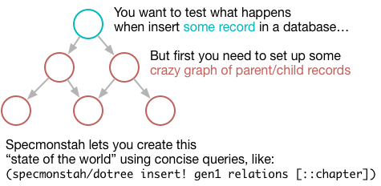
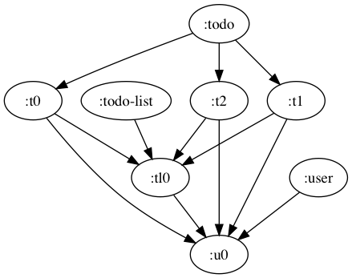

# Specmonstah

* [Purpose](#purpose)
* [Tutorial](#tutorial)
* [Usage](#usage)
* [Glossary](#glossary)

## Purpose

Specmonstah lets you generate and manipulate deeply-nested,
hierarchical graphs of business data (what you typically store in a
relational database) using a concise DSL. It's great for dramatically
reducing the amount of boilerplate code you have to write for tests.



For example, say you need to test the insertion of a few _Todos_ in a
database: your foreign key constraints would require you to first
insert the _TodoList_ that the to Todo belongs to, and the _User_ that
the TodoList and Todo belong to. To do that, you could use the
following to generate the graph:

```clojure
(ns your-project.core
  (:require [reifyhealth.specmonstah.core :as sm]
            [loom.io :as lio]))

;; The schema is similar to a db schema. It's used to establish
;; entity types and relationships among instances of those entities.
;; You only have to write the schema once.
(def schema
  {:user      {:prefix :u}
   :todo      {:relations {:created-by-id [:user :id]
                           :updated-by-id [:user :id]
                           :todo-list-id  [:todo-list :id]}
               :prefix    :t}
   :todo-list {:relations {:created-by-id [:user :id]
                           :updated-by-id [:user :id]}
               :prefix    :tl}})

;; The graph is under `:data`, and `lio/view` produces an image
;; of the graph.
(-> (sm/build-ent-db {:schema schema} {:todo [[3]]})
    :data
    lio/view)
```



This graph shows that you've generated three Todos which belong to a
single TodoList. The Todos and TodoList both are both related to a
User. In the line `(sm/build-ent-db {:schema schema} {:todo [[3]]})`,
you're using the _query_ `{:todo [[3]]}` to tell the function
`sm/build-ent-db` to generate three Todos. `sm/build-ent-db` uses
`schema` to generate `User` and `TodoList` entities without your
having to specify them in your query.

The graph only contains entity types, and entity instances and their
relationships; it doesn't include fields for the entities like the
user's name or the todo list's name. Once you've generated the graph,
it's straightforward to visit each node in the graph to a) use
clojure spec to generate that data and b) insert the generated data
into a database.

Specmonstah was born out of a need to replace brittle, repetitive code
for creating deeply-nested hierarchies of data in unit tests. This
guide's tutorial will show you how to use Specmonstah specifically for
this use case. Along the way you'll learn how to make the most of
Specmonstah by understanding how it's not implemented to support
writing unit tests per se, but to support the more fundamental
operations of generating and manipulating entity graphs.

## Tutorial

In learning any new tool, I think it's useful to begin by learning the
tool's purpose, then getting a high-level overview of the architecture
and how it achieve's the tool's purpose. With those concepts in place,
concrete examples and exercises will help you understand how to use
the tool. So let's start with Specmonstah's purpose.

Specmonstah was built to aid testing by generating and inserting
records in a database in dependency order. For example, if you want to
test the insertion of a Todo, but that Todo depends on the existence
of a TodoList, and the TodoList depends on a User, then Specmonstah
will generate User and TodoList records and insert them without your
having to clutter your test with code related to Users and TodoLists.

To accomplish this, Specmonstah does the following:

**1. Graph generation (and ent/ent type definitions)**

It generates a graph whose nodes correspond to _entity types_ (or _ent
types_) and _entities_ (or just _ents_):


In the graph above, the `:todo`, `:todo-list`, and `:user` nodes
correspond to ent types, and the rest correspond to ents.

We're going to be using the terms _ent_ and _ent type_ a lot, and
you'll see them all throughout the source code, so let's define them:

**Ent type.** An ent type is kind of analogous to a relation in a
relational database, or a class in object-oriented programming. It
differs in that relations and classes define all the attributes of
their instances, whereas ent types don't. Ent types define how ent
instances are related to each other. For example, the `:todo` ent type
wouldn't include a `:description` attribute, but it does specify that
a `:todo` instances reference `:todo-list` instances. In the next
section you'll learn how to define ent types.

Ent types are represented as nodes in the Specmonstah graph (let's
abbreviate that with _SG_). Ent types have directed edges to their
instances. It's rare that you'll interact with ent types directly.

**Ent.** An ent is an instance of an ent type. They have a name (`:t0,
:u0`, etc), and reference other ents. They're represented as nodes in
the SG, with directed edges going from ents to the ents they
reference; there's a directed edge from `:tl0` to `:u0` because `:tl0`
references `:u0`.

Ents can be associated with additional data - for example, a user ent
can be associated with a map of user data generated by
clojure.spec. An ent can also be associated with a value indicating
whether or not its spec data has been inserted in a database.

It's important to stress that ents themselves aren't db records, but
ents can be (and are) associated with data that ends up getting
inserted in a database. This is why we represent ents as nodes: nodes
capture the relationships among ents and serve as a flexible base
layer that we can add data to.

How does Specmonstah generate this graph? You'll be learning about
that in the upcoming sections.

**2. Node visitation**

**3. Viewing**


### WIP

the below sections aren't ready for review

2. It visits each ent and generates the data that should be inserted
   using clojure.spec. It
3.

The tutorial builds toward accomplishing Specmonstah's primary use
case: inserting records in a database

Specmonstah's purpose is to create a graph of _entities_ and make it
easy to do things with the entities, like generate and insert
data. For example, you might want to easily create 3 Todo entities,
which belong to one TodoList entity, which belongs to a User entity.

You've seen the term _entity_ used about 800 times already, and you're
going to see it a lot more. The term roughly corresponds to a _record_
in database, but it's not the same thing.

### 01: schema, query, ent-db

The tutorial consists of a sequence of clojure files under the
[](tutorial/reifyhealth/specmonstah_tutorial) directory, each
introducing a new concept. You'll have the best experience if you
follow along in a REPL, starting with
[reifyhealth.specmonstah-tutorial.01](tutorial/reifyhealth/specmonstah_tutorial/01.clj):

```clojure
(ns reifyhealth.specmonstah-tutorial.01
  (:require [reifyhealth.specmonstah.core :as sm]
            [loom.io :as lio]))

(def schema
  {:user {:prefix :u}})

(defn ex-01
  []
  (sm/build-ent-db {:schema schema} {:user [[3]]}))

(defn ex-02
  []
  (sm/build-ent-db {:schema schema} {:user [[:circe]]}))
```

Throughout the tutorials, I'll use functions named `ex-01`, `ex-02`,
etc, to illustrate some concept. We'll begin by using `ex-01` to
explore how Specmonstah's `build-ent-db` takes a _schema_ and a
_query_ to build an _ent-db_.

Let's look at specific examples of these terms to construct the terms'
definition:

* call to `build-ent-db`: `(sm/build-ent-db {:schema schema} {:user [[3]]})`
* _schema_: `{:user {:prefix :u}}`
* _query_: `{:user [[3]]}`

When you call `ex-01` the, _ent-db_ returned contains the following
key/value pairs:

```clojure
{:schema {:user {:prefix :u}}
 :data   {:nodeset #{:u1 :u0 :u2 :user}
          :adj     {:user #{:u1 :u0 :u2}}
          :in      {:u0 #{:user} :u1 #{:user} :u2 #{:user}}
          :attrs   {:user {:type :ent-type}
                    :u0   {:type :ent :index 0 :ent-type :user :query-term [3]}
                    :u1   {:type :ent :index 1 :ent-type :user :query-term [3]}
                    :u2   {:type :ent :index 2 :ent-type :user :query-term [3]}}}}
 ```


## Usage

## Glossary

## Contributing

I'm looking to exercise Specmonstah 2 against the following use cases:

* Generating data for unit tests. What to look for:
  * Are there surprises?
  * Can it handle deeply nested combinations of `:coll` and `:uniq`
    relationships?
  * Does binding work as expected?
  * Is it easy to retrieve the views of the specmonstah db needed for
    a test? For example, if you want to generate 2 Todos for
    insertion, but a TodoList and a User also get generated, can you
    access just the Todos with minimal code?
* Generating seed data.
  * Can you easily and clearly specify an entire database? For
    example, can you express "I want to create a db with 3 todo lists
    belonging to 2 users, where one list has 5 items, one has 1, and
    one has 0".
  * Can you easily tweak the above? For example if you want to create
    an additional todo list but leave everything else the same, or
    generate only empty todo lists.
* Progressively generating and mapping a database.
  * Does anything unexpected happen if you create an entity database
    and map over it to perform inserts over multiple calls?
